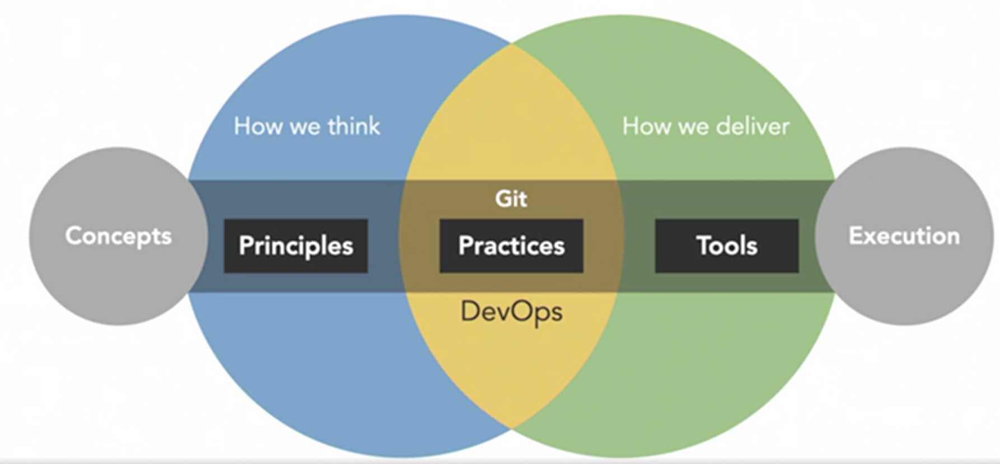
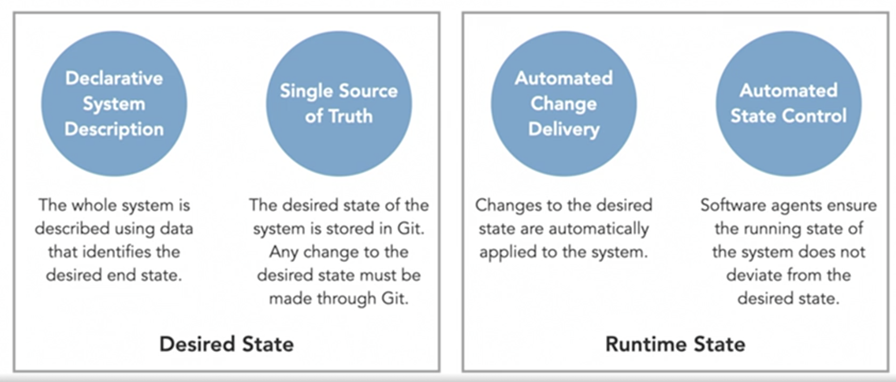

---
title: DevOps and GitOps
layout: page
permalink: /devops-and-gitops/
filename: DevOps_and_GitOps.md
--- 

# Introduction

*DevOps* is a mixture of principles, practices, and tools that allow teams to deliver higher quality software at a faster pace. The principles are generally agreed upon. However, the practices can vary differently across groups and in some cases they are tough to put in place.

DevOps starts with culture. Teams embrace *principles* like breaking down silos, continuous improvement, automation, and 
frequent communication that improve how they deliver software. These principles *change the way people in an organization think* 
about developing and operating digital products. This influences how they work and they adopt practices that rapidly deliver 
small incremental changes. 

Tools are needed to automate and support these practices. This is why teams that embrace DevOps use tools that enable practices 
like frequent communication, CI/CD, and containerization. So, there are two sides of DevOps, the concept and the execution.

*GitOps* applies a Git-centric approach on top of some common DevOps principles, practices, and tools. So, these principles are centered around Git and mixed with the DevOps workflows to get this new way of operating and managing software.

In GitOps all system changes are are described in Git as commits which make up the desired state of the system. This desired state is reflected in a running system via *control or a reconciliation loop*.

# Why GitOps

Stability, Consistency and Continuois Deployment Automation.

* *Stabilizes* systems experiencing a high rate of change
* Applies *consistent* development workflow to operations
* Continuous deployment automation

# Key Principles of GitOps

